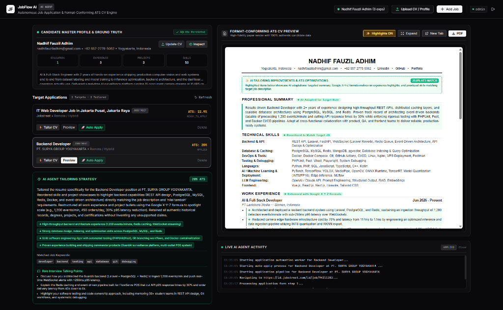

# JobFlow AI
### Autonomous Job Application Engine and Format-Conforming ATS Resume Tailor

[](https://www.python.org/downloads/)
[](https://fastapi.tiangolo.com/)
[](https://www.sqlalchemy.org/)
[](https://playwright.dev/)
[](https://www.docker.com/)
[](https://opensource.org/licenses/MIT)

JobFlow AI is an autonomous, end-to-end job application system designed to bridge the gap between candidate qualifications and enterprise Applicant Tracking Systems (ATS). The platform incorporates an intelligent AI Agent Harness that adapts resumes to specific job listings while strictly preserving authentic candidate background data, structural formatting, and visual layout.

---



---

## Architectural Highlights

### 1. Format-Conforming AI Agent Harness
Unlike traditional resume builders that force static templates, JobFlow AI treats the uploaded resume as an immutable ground truth. The agent harness:
- Ingests raw CV text or PDF uploads and dynamically extracts standard and custom sections (Experience, Education, Projects, Skills, Certifications, Achievements, Languages).
- Preserves the exact section hierarchy and layout formatting of the candidate's original resume.
- Applies the Google X-Y-Z formula (*Accomplished [X], as measured by [Y], by doing [Z]*) to reframe project and experience highlights without fabricating credentials.
- Injects targeted technical keywords identified during job requirement deconstruction.
- Provides interactive visual diff highlights to review AI modifications before export or application.

### 2. Candidate Master Profile and Database Persistence
- Profiles and tailored resumes are persisted via an asynchronous SQLAlchemy database layer (SQLite by default, PostgreSQL ready).
- Candidate information, original CV structure, tailored revisions, and application records remain persistent across application restarts and page reloads.

### 3. Multi-Platform Job Intelligence
- Automatic metadata and requirements extraction for job postings across LinkedIn, JobStreet, Glints, and generic corporate career portals.
- Analyzes job description text to extract prioritized requirements, tech stacks, and domain qualifications.

### 4. Stealth Automation Engine
- Powered by Playwright with human jitter, persistent browser session state, and intelligent Q&A rule solvers.
- Automated form submission with screenshot capture and comprehensive execution logging.

### 5. Deployment Security and Session Authentication
- Built-in security gateway supporting standalone and public VPS deployments.
- Cryptographic HMAC-SHA256 session token generation and verification using Python standard library primitives.
- Constant-time signature comparison to mitigate timing attacks.
- Supports HTTP-only signed session cookies for web browsers and Bearer token authorization headers for programmatic API consumers.

---

## System Architecture

```text
  +-----------------------------------------------------------------------+
  |                          Web Dashboard UI                             |
  |             Monochrome Dark Workstation - Split Studio Layout         |
  +-----------------------------------+-----------------------------------+
                                      |
                                      v
  +-----------------------------------------------------------------------+
  |                           FastAPI Gateway                             |
  |       HMAC Session Auth - Async REST Endpoints - OpenAPI Docs         |
  +-----------------+---------------------------------+-------------------+
                    |                                 |
                    v                                 v
  +-----------------------------------+   +-------------------------------+
  |        AI Agent Harness           |   |       Database Layer          |
  |  - Requirements Deconstruction    |   |  - SQLAlchemy 2.0 Async       |
  |  - Format-Conforming Synthesis    |   |  - Candidate Profile Store    |
  |  - Visual Highlight Tagging       |   |  - Tailored CVs & Job Records |
  |  - Google X-Y-Z Bullet Framing    |   +-------------------------------+
  +-----------------+-----------------+
                    |
                    +---------------------------------+
                    |                                 |
                    v                                 v
  +-----------------------------------+   +-------------------------------+
  |      ReportLab / HTML Engine      |   |       Playwright Stealth      |
  |  - High-Fidelity Paper Canvas     |   |  - Human Jitter Navigation    |
  |  - Format-Conforming ATS PDF      |   |  - Form Q&A Auto-Solver       |
  +-----------------------------------+   +-------------------------------+
```

---

## Installation and Quick Start

### Option A: Docker Deployment (Recommended)

1. Clone the repository:
   ```bash
   git clone https://github.com/NadhifFauzilAdhim/jobflow-ai.git
   cd jobflow-ai
   ```

2. Initialize environment variables:
   ```bash
   cp .env.example .env
   ```

3. Launch the containerized application:
   ```bash
   docker compose up --build -d
   ```

4. Access the dashboard at `http://localhost:8000`.

---

### Option B: Local Environment Setup

#### Prerequisites
- Python 3.11 or higher
- Git

#### 1. Setup Virtual Environment
```bash
python -m venv .venv

# On Windows:
.\.venv\Scripts\activate

# On Linux/macOS:
source .venv/bin/activate
```

#### 2. Install Dependencies
```bash
pip install -e .
playwright install chromium
```

#### 3. Configure Environment
Create a `.env` file in the project root:
```env
APP_NAME=JobFlow AI
DATABASE_URL=sqlite+aiosqlite:///data/jobflow.db

# Authentication
AUTH_ENABLED=true
AUTH_USERNAME=admin
AUTH_PASSWORD=your_secure_password_here
SECRET_KEY=replace_with_a_secure_random_key

# LLM Providers (Optional: system operates heuristics if keys are omitted)
GEMINI_API_KEY=
OPENAI_API_KEY=
ANTHROPIC_API_KEY=
GROQ_API_KEY=
```

#### 4. Run the Application
Start the Uvicorn web server:
```bash
python -m uvicorn jobflow.api.app:app --host 127.0.0.1 --port 8000 --reload
```
Navigate to `http://127.0.0.1:8000` to sign in.

---

## Command Line Interface (CLI)

JobFlow AI provides a Typer-powered command line interface:

- **Start Web Dashboard:**
  ```bash
  jobflow serve --host 127.0.0.1 --port 8000
  ```

- **Direct Resume Tailoring via CLI:**
  ```bash
  jobflow tailor --title "Backend Engineer" --company "Acme Labs" --desc "FastAPI PostgreSQL Redis Docker" --output tailored.pdf
  ```

---

## Security and Authentication

When `AUTH_ENABLED=true`, all sensitive API routes and dashboard interfaces require valid credentials.

- **Web Browser Authentication**: Authentication occurs via `POST /api/auth/login`. On success, an `HttpOnly`, `SameSite=lax` cookie named `jobflow_session` is issued.
- **Programmatic API Authentication**: API requests accept standard Authorization headers:
  ```http
  GET /api/jobs HTTP/1.1
  Host: 127.0.0.1:8000
  Authorization: Bearer <your_session_token>
  ```
- **Public Endpoints**: The health check (`GET /health`), login page (`GET /login`), and static assets (`GET /static/*`) are accessible without authentication.

---

## Test Suite

The test suite covers authentication, security tokens, candidate profile persistence, resume generation, and multi-platform parsers.

Run automated tests using pytest:
```bash
pytest tests/ -v
```

Test coverage includes:
- `tests/test_auth.py`: Token verification, HMAC tampering rejection, unauthenticated access restrictions, and cookie management.
- `tests/test_api.py`: REST endpoint contracts, session authentication, and database persistence.
- `tests/test_core.py`: ATS scoring algorithms and keyword frequency extractors.
- `tests/test_cv_agent.py`: Agent harness extraction, section schema normalization, and Google X-Y-Z formatting.

---

## Project Structure

```text
jobflow-ai/
├── data/
│   ├── jobflow.db               # SQLite database file
│   └── master_profile.json      # Master profile baseline
├── docs/
│   └── images/
│       └── dashboard-preview.png# Interface screenshot
├── src/jobflow/
│   ├── api/
│   │   ├── app.py               # Main FastAPI application & middleware
│   │   └── routes/              # Auth, Jobs, Profile, Resume, Apply routes
│   ├── automations/
│   │   ├── applier.py           # Playwright application worker
│   │   └── form_solver.py       # Heuristic form question solver
│   ├── core/
│   │   ├── agent_harness.py     # AI tailoring agent & section extraction
│   │   ├── ats_scorer.py        # ATS scoring engine
│   │   ├── pdf_generator.py     # High-fidelity PDF builder
│   │   ├── resume_engine.py     # Resume compilation orchestrator
│   │   ├── schema.py            # Pydantic data schemas
│   │   └── security.py          # Cryptographic tokens & credentials
│   ├── db/
│   │   ├── database.py          # SQLAlchemy async session engine
│   │   ├── models.py            # Job and CandidateProfile ORM models
│   │   └── profile_repo.py      # Profile repository and persistence logic
│   ├── extractors/
│   │   ├── generic.py           # Fallback job description extractor
│   │   └── platform_extractors.py # LinkedIn, JobStreet, Glints extractors
│   ├── templates/
│   │   ├── dashboard.html       # Split-screen studio dashboard
│   │   └── login.html           # Minimalist monochrome login interface
│   ├── cli.py                   # Typer CLI application
│   └── config.py                # Pydantic Settings configuration
├── tests/                       # Automated test suites
├── Dockerfile                   # Container build definition
├── docker-compose.yml           # Multi-service composition
└── pyproject.toml               # Package metadata and dependencies
```

---

## License

This project is licensed under the terms of the MIT License.
Developed by the JobFlow AI Open Source Community.
